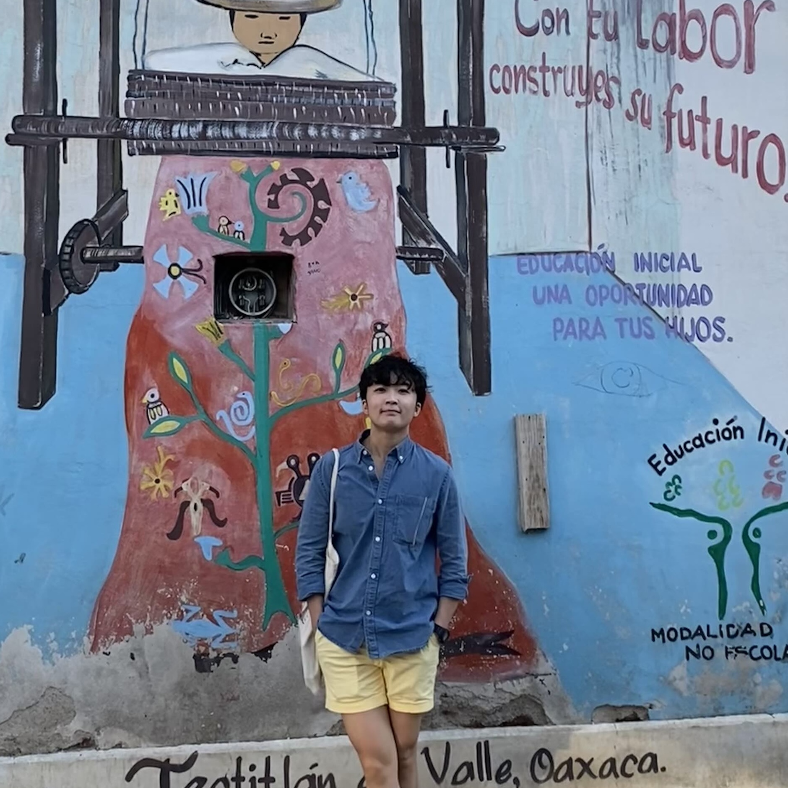

I’m Andrea Gao (she/her), a   founder based in NYC.

I grew up in Chongqing, China and spent my 20s in tech and consulting in the US (majorly). Then I decided to go touch grass—-start a company and see what real world problem I can solve. 

I love writing, which serves as a medium to present intriguing problems or shed light on unspeakable feelings.

In my spare time, I'm also a big movie fan--a regular at the New York Film Festival and independent movie theaters. 
