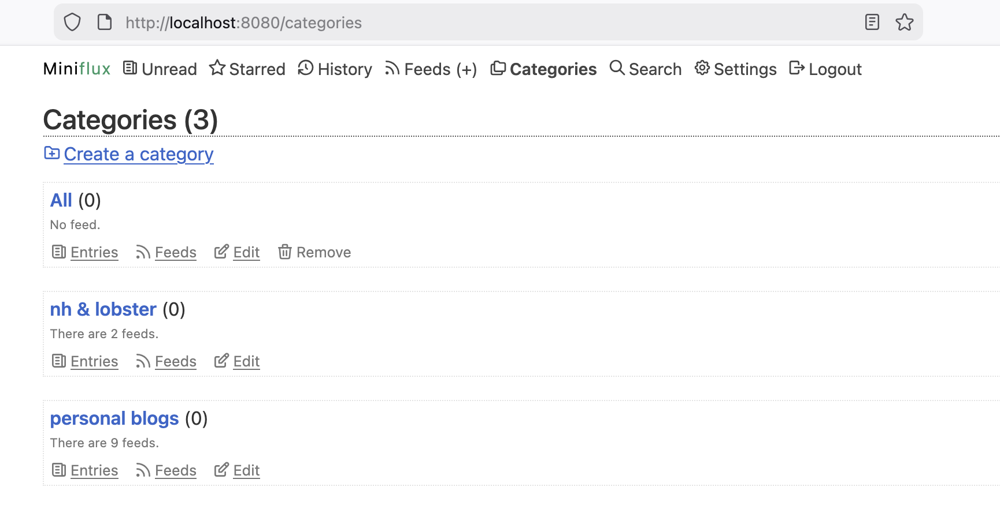

Short notes from what I read or what pops up in my head when I am in front of my task, walking out side, taking subway or waiting for someone. 
> "Syntax, then, is an app that uses a *tree* of phrases to translate a *web* of thoughts into a *string* of words."  - 2026.01.06

> "The guiding metaphor of classic style is seeing the world. The writer can see something that the reader has not yet noticed, and he orients the reader’s gaze so that she can see it for herself. The purpose, of writing is presentation, and its motive is disinterested truth. It succeeds when it aligns language with the truth, the proof of success being clarity and simplicity. The truth can be known, and is not the same as the language that reveals it; prose is a window onto the world. The writer knows the truth before putting it into words; he is not using the occasion of writing to sort out what he thinks. Nor does the writer of classic prose have to argue for the truth; he just needs to present it. This is because the reader is competent and can recognize the truth when she sees it, as long as she is given an unobstructed view. The writer and the reader are equals, and the process of directing the reader’s gaze takes the form of a conversation."  - 2026.01.02

> I was in an independent used bookstore in a suburban Texas town yesterday. The bookstore is a converted two-story house, in which the owner might still live with his family. My experience in the bookstore was surreal. The layout of the book store is labyrinthine; its book collection is time-transcendent; the owner's dog is aging and serves as a guard for a older time. I miss the older time, when I spent a whole day or afternoon in a bookstore tirelessly as a kid. I feel conflicted. Is this hermitic book store in a modern society that prioritizes efficiency a heaven or hell?  - 2025.12.31

> I set up a miniflux server locally today, which will help me read more via RSS. Installing miniflux locally requires Docker, a database, and server configuration. Even though ChatGPT made the installation process quite easy for me, it would be quite challenging for non-technical users. I wonder whether there are more easily accessible open-source software like Signal. Or is the enshitification of the internet unavoidable? 
  - 2025.12.29

> Even as a solo developer in a start-up environment, writing technical tutorials/documents is critical for efficiency. It's so easy to forget what(a technical implementation) I did and why I did it just 2 weeks ago.  - 2025.12.08

> NYC is still full of serendipity after years...  

  - 2025.12.06

> I've found myself "read" faster with audio book than with paper book or kindle, because I can listen while walking, running or doing errands. Though I think audio book still works better for casual content like popular novel, "reading" something is better than nothing.  - 2025.12.06

> "Annuities" are not often discussed in personal finance comparing with 401K. Based on a [WSJ article](https://www.wsj.com/personal-finance/vanguard-401k-regular-payout-170fd8f6?st=SYc1Df&reflink=desktopwebshare_permalink), major providers like Vanguard have started offering annuity payouts along with their 401k plans. Annuities still don’t seem to be a mainstream retirement vehicle in the US, and I’m very curious about the historical and societal reasons behind that.  - 2025.12.04

> I recently noticed that the word "algorithm" has lost its original meaning in daily life: most non-tech people use "algorithm" as a synonym for recommendation system in conversations or in the news media. Unfortunately, recommendation systems are so pervasive and addictive nowadays, that it makes "algorithm" a native word.  - 2025.12.03

> "Alternative data offers the opportunity to work with truly unique,hard-to-process
datasets. Remember, data that is hard to store, manipulate, and operate is always the
most promising. You will recognize that a dataset may be useful if it annoys your data
infrastructure team.Perhaps your competitors did not try to use it for logistic reasons,
gave up midway, or processed it incorrectly." - 2025.12.01

> “你一个人？她没有回答。在装有日光灯的理发铺子前，你于是看到了她的脸，年纪轻轻，却有点憔悴，倒更显得楚楚动人。你望着套上电吹风头罩烫发的女人，说现代化就数这最快。她眼睛动了一下，笑了，你也跟着就笑。她头发散披在肩上，乌黑光亮，你想说你头发真好，又觉得有点过分，没有出口。你同她一起走着，再没说什么。不是你不想同她亲近，而是你一时找不到语言。你不免尴尬，想尽快摆脱这种窘境。” - 2017.07.31

> “谈谈你的童年，谈谈你自己。她不要听你的那些故事了，她要知道你的过去，你的童年，你的母亲，你的老祖父，那怕那些最细小的事情，你摇篮里的记忆，她都想知道，你的一切，你最隐秘的感情。你说你都已经遗忘了。她说她就要帮你恢复这些记忆，她要帮你唤起你记忆中遗忘了的人和事，她要同你一起到你记忆中去游荡，深入到你的灵魂里，同你一起再经历一次你已经经历过的生命。” - 2017.07.31

